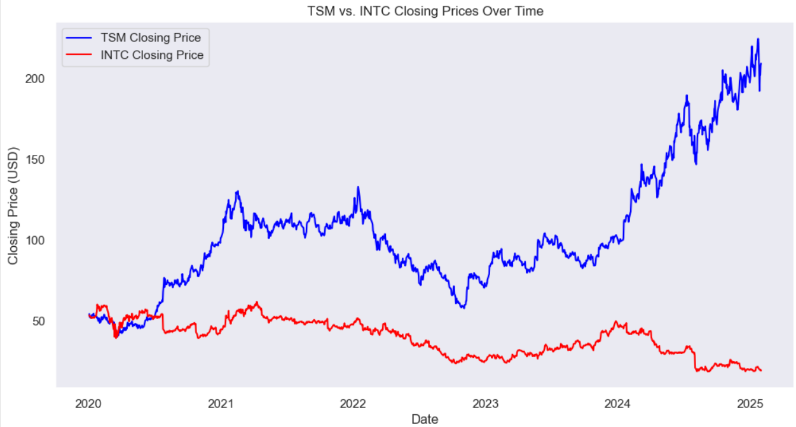
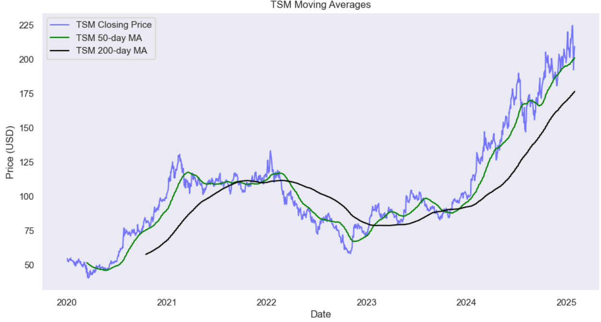
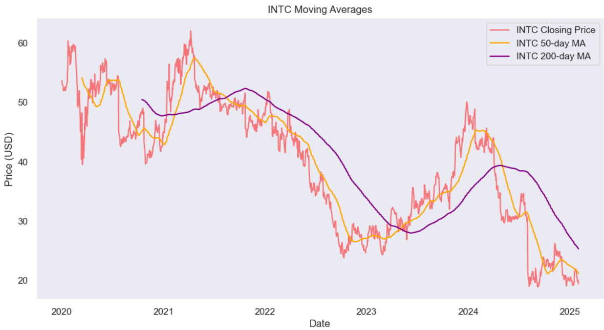
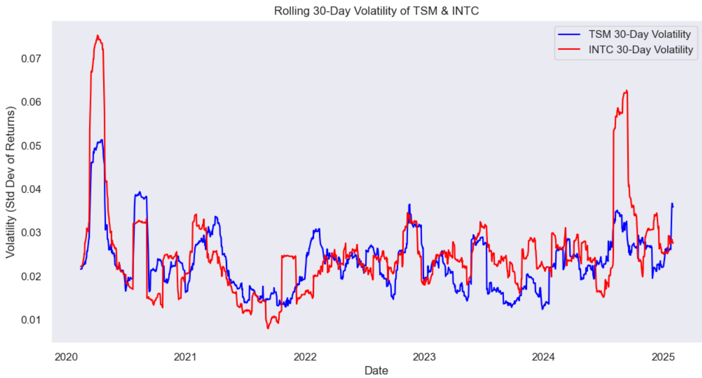
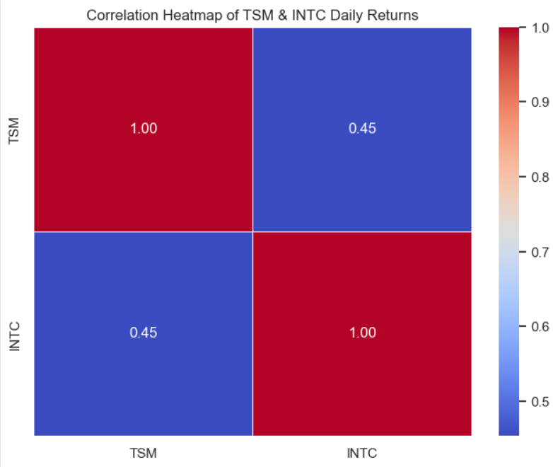

# Stock-Market-Visualization
This is the project I created to visualize the stock prices for 2 companies - TSMC &amp; INTC, with Python.

## Overview
This project analyzes and visualizes stock price trends and correlations between **Taiwan Semiconductor Manufacturing Company (TSM)** and **Intel Corporation (INTC)**. The analysis includes:

- **Time Series Visualization**: Closing prices, moving averages, and rolling volatility.
- **Correlation Analysis**: Heatmap and scatter plot of daily returns.

## Features
1. **Closing Price Trends**
   - Line plot comparing TSM and INTC closing prices over time.
2. **Moving Averages**
   - 50-day and 200-day moving averages to identify trends.
3. **Rolling Volatility**
   - 30-day rolling standard deviation of daily returns.
4. **Correlation Heatmap**
   - Displays correlation between daily returns of TSM and INTC.
5. **Scatter Plot of Daily Returns**
   - Shows the relationship between TSM and INTC daily returns.

## Technologies Used
- **Python**
- **Pandas** (Data manipulation)
- **Matplotlib & Seaborn** (Data visualization)
- **Yahoo Finance (yfinance)** (Stock data retrieval)

## Installation & Usage
### Prerequisites
Ensure you have Python installed along with the required libraries:
```bash
pip install numpy pandas matplotlib seaborn yfinance
```

### Running the Script
Simply execute the Python script:
```bash
python stock_visualization.py
```

## Example Visualizations
### Closing Prices


### Moving Averages



### Rolling Volatility


### Correlation Heatmap


## Author
[Your Name] - Business Intelligence & Data Visualization Enthusiast
